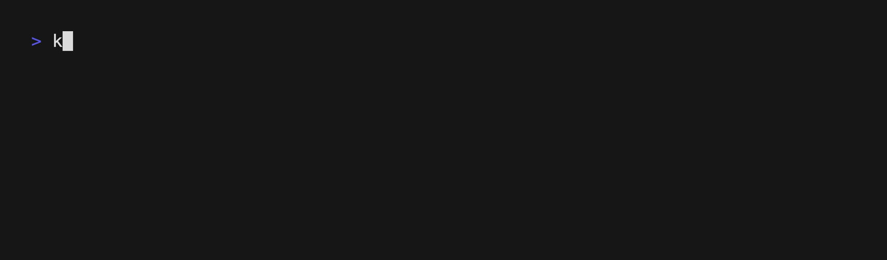
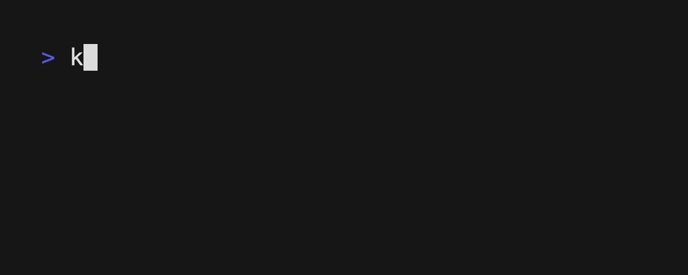

<h1 align="center">Kpm: KCL 包管理器</h1>

<p align="center">
<a href="./README.md">English</a> | <a href="./README-zh.md">简体中文</a>
</p>
<p align="center">
<a href="#introduction">介绍</a> | <a href="#installation">安装</a> | <a href="#quick-start">快速开始</a>
</p>

<p align="center">


</p>

## 介绍

`kpm` 是 KCL 包管理器。`kpm` 会下载您的 KCL 包的依赖项、编译您的 KCL 包、制作可分发的包并将其上传到 KCL 包的仓库中。

## 安装

### 安装 KCL

`kpm` 将调用 [KCL 编译器](https://github.com/KusionStack/KCLVM) 来编译 KCL 程序。在使用 `kpm` 之前，您需要确保 KCL编译器 已经成功安装。

[如需了解如何安装 KCL 的更多信息，请参考此处。](https://kcl-lang.io/docs/user_docs/getting-started/install)

使用以下命令来确保您已成功安装 `KCL`。

```shell
kclvm_cli version
```

如果上面的命令能为您正常展示 `KCL` 的版本信息，意味着您已经成功安装了 `KCL` 您就可以继续下一步操作。


### 安装 `kpm`

#### 使用 `go install` 安装

您可以使用 `go install` 命令安装 `kpm`。

```shell
go install kusionstack.io/kpm@latest
```

#### 从 Github release 页面手动安装

您也可以从 Github release 中获取 `kpm` ，并将 `kpm` 的二进制文件路径设置到环境变量 PATH 中。

```shell
# KPM_INSTALLATION_PATH 是 `kpm` 二进制文件的所在目录.
export PATH=$KPM_INSTALLATION_PATH:$PATH  
```

请使用以下命令以确保您成功安装了`kpm`。

```shell
kpm --help
```

如果你看到以下输出信息，那么你已经成功安装了`kpm`，可以继续执行下一步操作。


## 快速开始

### 初始化一个空的 KCL 包

首先，先为 KCL 包创建一个空的文件夹, 并且进入到这个文件夹中。

```shell
mkdir my_package # 创建一个新的文件夹 'my_package'
cd my_package # 进入这个文件夹中 'my_package'
```

创建一个叫做 `my_package` 的包。

```shell
kpm init my_package
```


`kpm` 将会在执行`kpm init my_package`命令的目录下创建两个默认的配置文件 `kcl.mod` 和 `kcl.mod.lock`。

```shell
- my_package
        |- kcl.mod
        |- kcl.mod.lock
        |- # 你可以直接在这个目录下写你的kcl程序。
```

`kcl.mod.lock` 是 `kpm` 用来固定依赖版本的文件，是自动生成的，请不要人工修改这个文件。

`kpm` 将会为这个新包创建一个默认的 `kcl.mod`。如下所示:

```shell
[package]
name = "my_package"
edition = "0.0.1"
version = "0.0.1"
```

### 为 KCL 包添加依赖

如果你想要使用 [Konfig](https://github.com/awesome-kusion/konfig.git) 中的 KCL 程序.

```shell
kpm add -git https://github.com/awesome-kusion/konfig.git -tag v0.0.1
```



`kpm` 会为您将依赖添加到 kcl.mod 文件中.

```shell
[package]
name = "my_package"
edition = "0.0.1"
version = "0.0.1"

[dependencies]
# 'konfig' 是依赖的包的名称
# 如果你想在你的 kcl 程序中使用包 'konfig' 中的内容，
# 你需要在 import 语句中使用包名 'konfig' 作为导入内容的前缀。
konfig = { git = "https://github.com/awesome-kusion/konfig.git", tag = "v0.0.1" }
```

### 编写一个程序使用包 `konfig` 中的内容

在当前包中创建 `main.k`。

```shell
- my_package
        |- kcl.mod
        |- kcl.mod.lock
        |- main.k # Your KCL program.
```

并且将下面的内容写入 `main.k` 文件中。

```kcl
import konfig.base.examples.native.nginx_deployment as nd

demo = nd.demo
```

### 使用 `kpm` 编译 kcl 包

你可以使用 kpm 编译刚才编写的 `main.k` 文件。

```shell
kpm run
```


如果你想要使用 `KCL` 的某些编译选项来编译当前 kcl 包，你可以通过 kpm 的参数 `--kcl_args` 来将这个参数传递给 `KCL`。

如下所示，我们将使用 `KCL` 编译选项 `-S demo` 来编译 kcl 包。

```shell
kpm run --kcl_args '-S demo'
```


### 打包您的 kcl 包

你可以使用 `kpm pkg` 将您的包与其对应的依赖打包在一起.

```shell
kpm pkg --target my_package_tar
```



这个命令执行后，您可以看到您的 kcl 包已经被打包到了 `my_package_tar` 文件目录下，并且 `my_package` 的依赖也都被复制到了当前包的 `vendor` 子目录下。

```shell
- my_package
        |- kcl.mod
        |- kcl.mod.lock
        |- main.k
        |- my_package.tar # `kpm pkg` 命令生成的 tar 包。
        |- vendor # 当前包所有的依赖都将被复制到 `vendor`中。 
             |- konfig_v0.0.1
```

## OCI Registry 的支持

从 kpm v0.2.0 版本开始，kpm 支持通过 OCI Registries 保存和分享 KCL 包。

了解更多如何在 kpm 中使用，查看 [OCI registry 支持](./docs/kpm_oci-zh.md).
