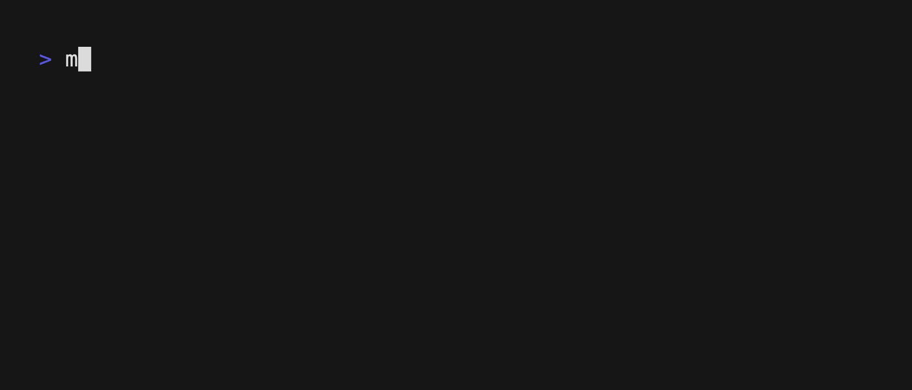
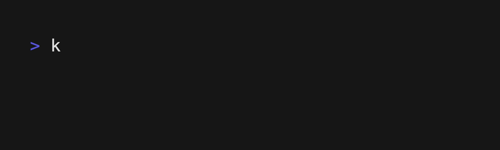

<h1 align="center">Kpm: KCL Package Manager</h1>

<p align="center">
<a href="./README.md">English</a> | <a href="./README-zh.md">简体中文</a>
</p>
<p align="center">
<a href="#introduction">Introduction</a> | <a href="#installation">Installation</a> | <a href="#quick-start">Quick start</a> 
</p>

<p align="center">


</p>

## Introduction

`kpm` is the KCL package manager. `kpm` downloads your KCL package's dependencies, compiles your KCL packages, makes packages, and uploads them to the kcl package registry.

## Installation

### Install KCL

`kpm` will call [KCL compiler](https://github.com/KusionStack/KCLVM) to compile the kcl program. Before using `kpm`, you need to ensure that `KCL compiler` is installed successfully.

[For more information about how to install KCL.](https://kcl-lang.io/docs/user_docs/getting-started/install)

Use the following command to ensure that you install `KCL compiler` successfully.

```shell
kcl -V
```

### Install `kpm`

#### Go install

You can download `kpm` via `go install`.

```shell
go install kusionstack.io/kpm@latest
```

#### Download from GITHUB release page

You can also get `kpm` from the github release and set the `kpm` binary path to the environment variable PATH.

```shell
# KPM_INSTALLATION_PATH is the path of the `kpm` binary.
export PATH=$KPM_INSTALLATION_PATH:$PATH  
```

Use the following command to ensure that you install `kpm` successfully.

```shell
kpm --help
```

If you get the following output, you have successfully installed `kpm` and you can proceed to the following steps.


## Quick Start

### Init an empty kcl package

Create a new kcl package named `my_package`. And after we have created the package `my_package`, we need to go inside the package by `cd my_package` to complete the following operations.

```shell
kpm init my_package
```



`kpm` will create two kcl package configuration files: `kcl.mod` and `kcl.mod.lock` in the directory where you executed the command.

```shell
- my_package
      |- kcl.mod
      |- kcl.mod.lock
      |- # You can write your kcl program directly in this directory.
```

`kcl.mod.lock` is the file generated by `kpm` to fix the dependency version. Do not modify this file manually.

`kpm` initializes `kcl.mod` for an empty project as shown below:

```shell
[package]
name = "my_package"
edition = "0.0.1"
version = "0.0.1"
```

### Add a dependency from Git Registry

You can then add a dependency to the current kcl package using the `kpm add` command

As shown below, taking the example of adding a package dependency named `k8s`, the version of the package is `1.27.2`.

```shell
kpm add k8s:1.27.2
```



You can see that `kpm` adds the dependency you just added to kcl.mod.

```shell
[package]
name = "my_package"
edition = "0.0.1"
version = "0.0.1"

[dependencies]
k8s = "1.27.2" # The dependency 'k8s' with version '1.27.2'
```

### Write a kcl program that uses the content in `k8s`

Create the `main.k` file in the current package.

```shell
- my_package
      |- kcl.mod
      |- kcl.mod.lock
      |- main.k # Your KCL program.
```

And write the following into the `main.k` file.

```kcl
# Import and use the contents of the external dependency 'k8s'.
import k8s.api.core.v1 as k8core

k8core.Pod {
    metadata.name = "web-app"
    spec.containers = [{
        name = "main-container"
        image = "nginx"
        ports = [{containerPort = 80}]
    }]
}

```

### Use the `kpm` compile the kcl package

In the `my_package` directory, you can use `kpm` to compile the `main.k` file you just wrote.

```shell
kpm run
```


## Supports OCI Registry

Beginning in kpm v0.2.0, you can use container registries with OCI support to store and share kcl packages.

For more information about [OCI registry support](./docs/kpm_oci.md).

## Learn More

[OCI registry support](./docs/kpm_oci-zh.md).
[How to share your kcl package with others using kpm](./docs/publish_your_kcl_packages-zh.md).
