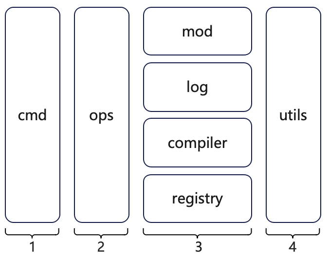

# The source code structure of kpm

## The overall structure of kpm is organized as follows:

part 1: The kpm cli.
- `cmd`:  `cmd` is the cli and is responsible for receiving input commands.

part 2: All the operations.
- `ops`: Provide operations to the `cmd`, such as `InitEmptyMod` to create an empty module, `AddDependency` to add a dependency.

part 3: Support the implementation of all the operations in `ops`.

At present, in the mvp version, it mainly contains four parts: 

- `mod`: Provides operations implementation on `module`, mainly includes io operations with the local file system. All operations on modules required in `ops` are provided by `mod`.
- `log`: Provides operations implementation on `log`, includes anything related to the logging system. All operations on log required in `ops` are provided by `log`.
- `compiler`: Provides operations implementation on `compiler`, it is mainly responsible for the interaction with kclvm. All operations on compiler required in `ops` are provided by `compiler`.
- `registry`: Provides operations implementation on `registry`. All operations on registry required in `ops` are provided by `registry`.

part 4:
- `utils`: Provide some utility methods 

