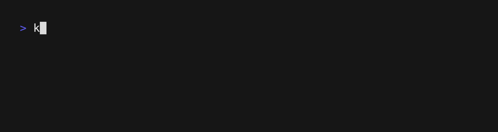
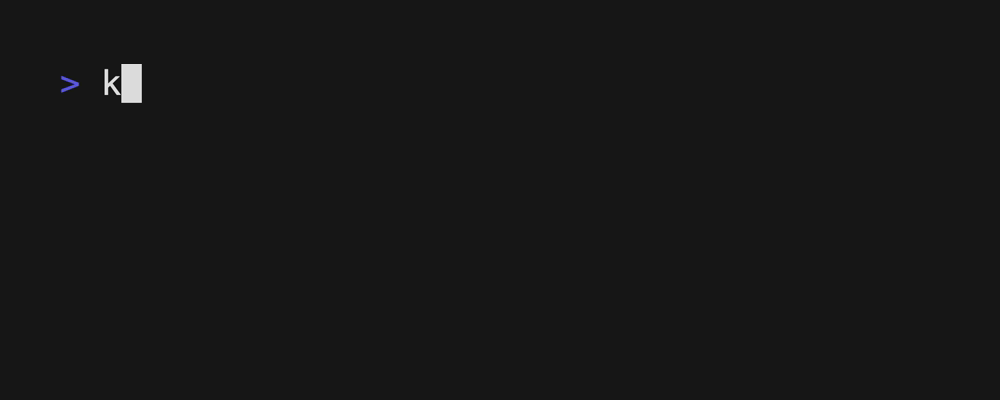
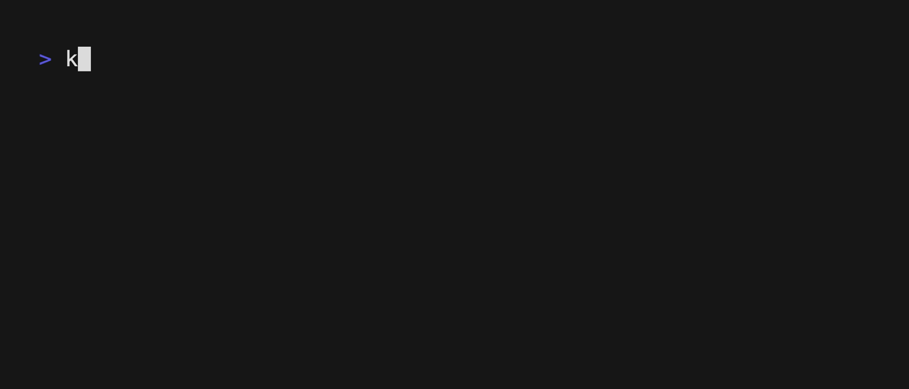
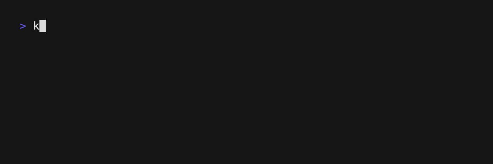

# 使用 OCI Registries

从 kpm v0.2.0 版本开始，kpm 支持通过 OCI Registries 保存和分享 KCL 包。

## kpm registry

kpm 支持使用 OCI Registry 保存和分享 KCL 包，kpm 默认使用 ghcr.io 保存 KCL 包。

kpm 默认 registry - [https://github.com/orgs/KusionStack/packages](https://github.com/orgs/KusionStack/packages)

可以在 kpm 的配置文件中调整 Registry 的地址和仓库名。kpm 的配置文件位于 `$KCL_PKG_PATH/.kpm/config.json`, 如果没有设置环境变量 `KCL_PKG_PATH` 的值，则默认保存在 `$HOME/.kcl/kpm/.kpm/config.json`。

配置文件的默认内容如下：

```json
{
    "DefaultOciRegistry":"ghcr.io",
    "DefaultOciRepo":"kcl-lang"
}
```

## 快速开始在 kpm 中使用 OCI Registry

在接下来的内容中，我们将使用 `localhost:5001` 作为示例 OCI Registry，并且为这个 OCI Registry 添加了一个账户 `test`，密码是 `1234`。

### kpm login

你可以通过以下四种方式使用 `kpm login`。

#### 1. 使用账户和密码登陆 OCI Registry

```shell
$ kpm login -u <account_name> -p <password> <oci_registry>
Login succeeded
```



#### 2. 使用账户登陆 OCI Registry，并且交互式输入密码

```shell
$ kpm login -u <account_name> <oci_registry>
Password:
Login succeeded
```


#### 3. 交互式输入账户和密码登陆 OCI Registry

```shell
$ kpm login <oci_registry>
Username: <account_name>
Password:
Login succeeded
```


### kpm logout

你可以使用 `kpm logout` 退出一个 OCI Registry。

```shell
kpm logout <registry>
```



### kpm push

你可以在 kcl 包的根目录下使用 `kpm push` 命令将 kcl 包上传到一个 OCI Registry。

```shell
# 创建一个新的 kcl 包。
$ kpm init <package_name> 
# 进入 kcl 包的根目录
$ cd <package_name> 
# 将 kcl 包上传到一个 oci registry
$ kpm push
```


你也可以在 `kpm push` 命令中指定 OCI registry 的 url。

```shell
# 创建一个新的 kcl 包。
$ kpm init <package_name> 
# 进入 kcl 包的根目录
$ cd <package_name> 
# 将 kcl 包上传到一个 oci registry
$ kpm push <oci_url>
```


### kpm pull

你可以使用 `kpm pull` 从默认的 OCI registry 中下载一个 kcl 包。kpm 会自动从 `kpm.json` 中的 OCI registry 中寻找 kcl 包。

```shell
kpm pull <package_name>:<package_version>
```



或者，你也可以从指定的 OCI registry url 中下载一个 kcl 包。

```shell
kpm pull --tag <kcl_package_version> <oci_url>
```


### kpm run

kpm 可以直接通过 OCI 的 url 编译 kcl 包。

```shell
kpm run --tag <kcl_package_version> <oci_url>
```


另外，你也可以通过 `kpm run` 直接使用本地的 kcl 包。

```shell
kpm run <oci_ref>
```


